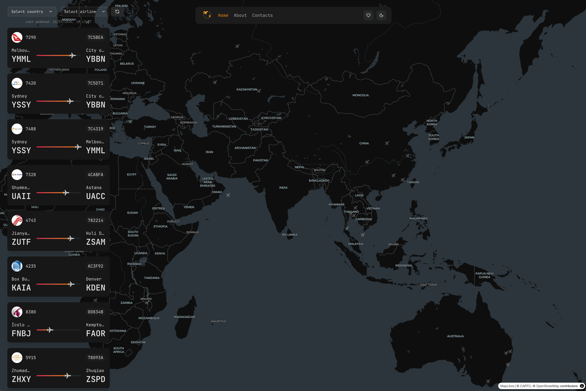
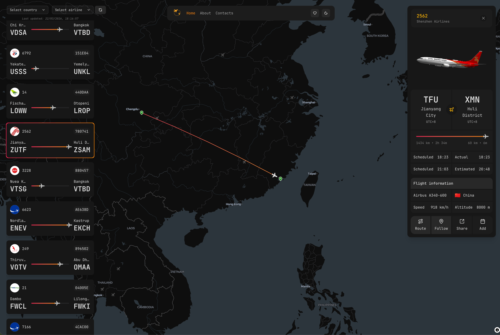
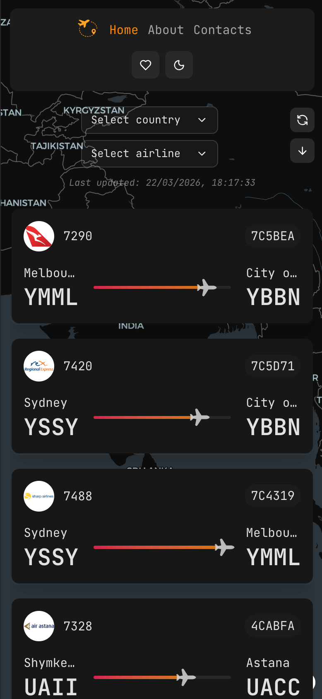

<p align="center">
  
</p>

<h1 align="center">✈️ Flight Tracking Web App</h1>

<p align="center">
  A real-time flight tracking app inspired by Flightradar24 — built with React, MapLibre GL, and AviationStack API.
</p>

<p align="center">
  <a href="https://sky-tracking.netlify.app/">🌐 Live Demo</a>
</p>

<p align="center">
  
  
  
  
  
</p>

---


## 📸 Screenshots

>  
> 

---

## ✨ Features

- 🗺️ **Interactive Map** — Live flight positions rendered on a MapLibre GL map with real-time updates
- 🔍 **Flight Detail View** — Select any flight to track its route, altitude, speed, and status changes
- ♾️ **Infinite Scroll** — Flight list loads progressively as you scroll, paginated via AviationStack API
- 📱 **Fully Responsive** — Optimized layout for both desktop and mobile devices
- 🔎 **Filters** — Filter flights by departure country or airline
- ⚡ **Data Caching** — Backend caches API responses to minimize external requests and improve performance
- 🛫 **Live Flight Data** — Powered by [AviationStack](https://aviationstack.com/) API

---

## 🗂️ Project Structure

```
flight-tracking-web-app/
├── src/                  # Frontend source
│   ├── components/       # UI components (map, flight list, cards)
│   ├── hooks/            # Custom React hooks
│   ├── services/         # API service layer
│   ├── store/            # Redux store & slices
│   └── data/             # Static data & utilities
├── backend/              # Express + tRPC server
│   └── src/
│       ├── index.ts      # Entry point
│       └── ...           # Routes, cache, middleware
└── public/               # Static assets
```

---

## 🖥️ Frontend

Built with React 19 and Vite, rendered on a MapLibre GL interactive map.

- **Path**: [`src`](./src)
- **Tech Stack**: React 19, TypeScript, MapLibre GL, React Map GL, TanStack Query, Redux Toolkit, Framer Motion, TailwindCSS, React Router

**Setup:**
```bash
npm install
npm run dev
```

---

## ⚙️ Backend

A lightweight Express server with tRPC, acting as a proxy to AviationStack with built-in response caching.

- **Path**: [`backend`](./backend)
- **Tech Stack**: Express 5, tRPC, Zod, Axios, Geolib, Bun

**Setup:**
```bash
cd backend
bun install
bun dev
```

---

## 🚀 Quick Start

1. Clone the repository:
```bash
git clone https://github.com/your-username/flight-tracking-web-app.git
cd flight-tracking-web-app
```

2. Install dependencies:
```bash
npm install
cd backend && bun install && cd ..
```

3. Set up environment variables:
```bash
# .env (root)
VITE_API_KEY=your_aviationstack_key

# backend/.env
AVIATIONSTACK_API_KEY=your_aviationstack_key
```

4. Run both client and server:
```bash
npm run dev          # frontend
npm run dev:server   # backend (separate terminal)
```

---

## 🛠️ Technologies

### Frontend


### Backend


---

## 🎯 Summary

A full-stack flight tracking application that brings real-time aviation data to life on an interactive map. Track active flights globally, dive into individual flight details, and filter by country or airline — all in a responsive interface that works seamlessly on desktop and mobile.

Data is sourced from **AviationStack** and cached on the backend to keep things fast and API-quota friendly.
